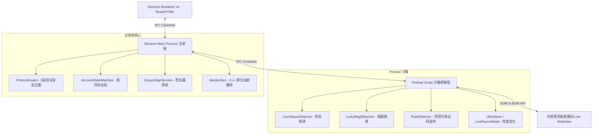

# Douyin Messenger 开源版详细技术说明与开发者指南

本项目是一个基于 **Electron + TypeScript** 开发的抖音多账号直播场控与自动化引擎。为了让开发者能够更好地进行二次开发、定制和扩展，本文件将对系统的核心架构、拦截策略、防风控算法、性能优化方案以及开源版的特性桩进行深度的技术拆解。

---

## 1. 整体系统架构与数据流

整个应用采用了经典的三层 Electron 架构：**主进程 (Main Process)**、**渲染进程 (Renderer Process)**、以及运行在隔离 WebView 沙箱中的 **Preload 脚本**。

### 1.1 系统架构拓扑图



### 1.2 核心目录结构说明

```
src/
├── main/                 # Electron 主进程
│   ├── auth/             # 登录凭证 Cookie 管理器、激活授权处理器
│   ├── ipc/              # 定义 IPC 消息通道和注册主进程处理器
│   ├── lifecycle/        # 应用初始化、窗口生命周期及崩溃自愈
│   ├── plugins/          # 拓展插件（如抖音签名引擎接口桩）
│   ├── security/         # 核心安全机制（包含 5 层协议拦截器和 C++ 原生模块）
│   ├── services/         # 全局业务服务（存储、全局自动化引擎、检测状态更新等）
│   └── window/           # 窗口创建、WebView 配置与多开管理
├── preload/              # Preload 脚本（运行在 WebView 沙箱内，可直接操作 DOM）
│   ├── core/             # 观测器基类 BaseObserver、双向消息桥梁 MessageBridge
│   ├── observers/        # 具体业务监听器（下播检测、验证码检测、福袋检测）
│   ├── operations/       # DOM 模拟操作（发送弹幕、抢福袋、模拟点击）
│   └── optimizers/       # 客户端性能提升模块（UltraSaver、视频/Canvas 屏蔽层）
├── renderer/             # 渲染进程（UI 视图与控制器）
│   ├── assets/           # 样式表、配置 JSON、多账号图标
│   ├── controllers/      # UI 层事件绑定与控制器
│   ├── renderers/        # 页面特定视图绘制（账号管理、福袋跟踪、挂机看板）
│   └── views/            # HTML 骨架（app.html, gift.html, lottery.html, random.html）
├── application/          # 应用层调度逻辑（多账号轮询器、重试引擎）
├── domain/               # 领域模型（Account 模型定义、账号状态机）
├── infrastructure/       # 基础设施（WebView 底层实例控制器）
└── shared/               # 共享层（公共类型定义、常量、Xpath/CSS DOM选择器）
```

---

## 2. 核心技术模块深度解析

### 2.1 5层协议安全拦截器 (`ProtocolGuard`)
为了彻底防止抖音页面中的 JS 脚本或安全 SDK 探测并唤起本机的外部防关联浏览器（如比特浏览器 BitBrowser）、或抖音客户端，项目在主进程中设计了 **5层协议安全拦截防御线**：

1. **Layer 1: 协议级静默处理器 (`protocol.handle`)**
   将所有被屏蔽的协议（如 `bitbrowser://`、`douyin://`、`snssdk://`、`intent://`）注册为静默空 Response 处理器，阻止系统默认行为。
2. **Layer 2: 系统调用拦截 (`shell.openExternal`)**
   劫持 Electron 原生的 `shell.openExternal` 接口，对于任何匹配屏蔽黑名单的 URL 直接返回，防止系统唤起外部 App。
3. **Layer 3: 导航与重定向拦截 (`web-contents-created`)**
   在每次新建 WebContents（包括主窗体及所有内嵌 WebView）时，监听 `will-navigate`、`will-redirect` 及 `setWindowOpenHandler` (即 `window.open`)，对于非正常协议强行调用 `preventDefault()` 拦截。
4. **Layer 4: Partition 隔离 Session 处理器 (`session-created`)**
   利用 `app.on('session-created')` 确保动态创建的 WebView Session 同样绑定了自定义协议的静默解析。
5. **Layer 5: 网络层包级拦截 (`webRequest.onBeforeRequest`)**
   在 WebRequest 阶段，检查所有即将发出的请求 URL，对匹配自定义协议的请求返回 `{ cancel: true }`。

#### 🛡️ 反探测反关联拓展
* **伪造内网 IP 穿透 (Layer 6)**: 每个 WebView 实例创建时，系统会自动随机分配一个固定 RFC 1918 私有 IP 地址（从 `10.x.x.x`、`172.16.x.x-172.31.x.x`、`192.168.x.x` 中产生），通过修改 `X-Forwarded-For`、`X-Real-IP` 和 `Client-IP` 请求头注入到每个 WebView 请求中，防止平台后端通过局域网内网 IP 对多开账号进行物理关联。
* **禁用 WebRTC 泄漏 (Layer 7)**: 通过调用 `setWebRTCIPHandlingPolicy('disable_non_proxied_udp')` 强行限制 WebRTC 绑定本地真实网卡 IP，防止由于 WebRTC 通信导致的多开漏网。

### 2.2 防风控与滑块验证守护者 (`RiskObserver`)
在挂机和自动发言过程中，可能会遭遇滑动验证码或挽留弹窗阻碍，`RiskObserver` 采用主动巡检与 MutationObserver 结合的双端防线：

* **干扰弹窗静态剥离**: 监控 DOM 树的节点新增，一旦匹配到 `.secsdk-captcha-container` (滑块容器)、`#guard-teen-dialog` (未成年提示)、`.webcast-live-end-recommend` (下播挽留卡) 等特征，立即将其 display 设置为 `none` 并从 DOM 树中物理移除。当检测到页面因为弹窗被锁死滚动（Body 的 `overflow: hidden`）时，强制重置为 `auto` 以恢复点击与输入穿透。
* **跨域滑块自动通知**: WebView 沙箱内的 Preload 脚本由于同源策略无法读取外部 iframe 的滑块按钮位置。当发现安全验证 URL 时，通过向主进程发送 `solve-iframe-captcha` IPC 信号，主进程在更高权限的 Frame 树上下达滑块操作指令以突破限制。

### 2.3 自动福袋探测与夺取 (`LuckyBagObserver`)
福袋是直播间常见的互动组件，但容易被频繁的 CSS 哈希混淆和页面屏蔽覆盖干扰：

* **非显示依赖可见度检测**: 传统检测使用 `offsetParent === null` 判断元素被隐藏，但在节能屏蔽层下，父容器可能已被 display: none 遮蔽。`LuckyBagObserver` 通过 `getBoundingClientRect()` 测定元素的真实渲染物理宽高大于 0，作为福袋是否浮现的唯一物理判据。
* **唯一 ID 去重队列**: 提取 `data-id` 或元素的 `getBoundingClientRect` 坐标并计算出特征哈希作为 `bagId`。一旦处理成功（执行 `ClaimLuckyBagOperation` 操作），将其送入去重 Map，在 5 分钟的生存周期内自动拒绝重复点击，节约系统资源，并避免因短时间重复触发点击福袋而被风控限制。

### 2.4 超低 CPU 占用视频与画布屏蔽层 (`UltraSaver` & `LiveRoomShield`)
挂机多账号时，最大的性能瓶颈来自于视频推流的解码渲染与 WebGL Canvas 动效生成。`UltraSaver` 模块专门为此而设计：

1. **静音暂停与防连接断开策略**: 直接销毁 `<video>` 的 `src` 会导致抖音直播间的 WebSocket 推流中断并被下线。`UltraSaver` 采取了**静音、暂停且将 opacity 设为 0** 的方法。此举在规避 GPU/CPU 解码开销的同时，完美保持了 WebSocket 心跳连接和自动发言功能的存活。
2. **隐藏 Canvas 替代销毁**: 强行移出页面中的礼物动效 Canvas 会触发 React/Vue 底层的重绘错误，导致浏览器不断重建 Canvas 元素，产生更剧烈的 CPU 抖动。我们直接通过 CSS 将 Canvas 规则修改为 `display: none !important` 强行屏蔽。
3. **节能提示占位挂载**: 自定义挂载一个低开销的静态 HTML 遮罩 `#__fake_player__`，并启动 5 秒一次的心跳监测，以确保在抖音 DOM 树更新时能够自愈遮罩，实现极佳的视觉节能效果。

---

## 3. 开源版特性与自备说明

本开源版保留了项目的核心主框架及自动化调度流程，但剔除了以下商业版闭源的安全与防风控代码：

### 3.1 签名服务引擎桩 (`src/main/plugins/douyin-sec/sign-service.ts`)
抖音在发送一些底层 API 请求（如心跳、获取弹幕等）时，需要携带加密签名参数（如 `a_bogus`、`msToken` 等）。
* **开源版实现**: 提供了 `generateABogus` 和 `generateWsSignature` 的空方法，默认返回 `null`。
* **开发者如何使用**: 您需要自行在此文件中补全这两个加密签名的生成算法。您可以通过调用外部签名 API、注入混淆后的签名 JS 文件（如原版的 `dy_ab.js`）等方式将其重构。

### 3.2 C++ 原生安全防护模块 (`src/main/security/native`)
为了防止客户端被调试篡改，项目引入了 Node.js C++ 插件 `JiandanSec.cc`，主要功能包括：
1. **反调试检测**: 检测 PEB 结构体的 `BeingDebugged` 标志以及调用 Win32 原生 API `CheckRemoteDebuggerPresent` 来判断程序是否在调试状态下运行。
2. **内存强力清退**: 当检测到调试器附加时，通过执行非法空指针写入操作强制制造崩溃，保护软件逻辑。
3. **硬件特征绑定 (HWID)**: 从 Windows 注册表中读取 BIOS 序列号（`SystemSerialNumber`）和机器唯一标识符（`MachineGuid`），以生成设备硬件码，实现机器授权锁定。

在开发时，如无需这些原生保护，您可以在 `src/main/security/guardian.ts` 中将 `JiandanSec` 的相关硬检测逻辑暂时屏蔽，使其直接返回授权通过。

---

## 4. 开发者上手指南

### 4.1 项目依赖编译
本项目的 C++ 安全模块基于 `node-addon-api`，在首次运行或打包前，您需要确保本地安装了 C++ 编译环境（如 Visual Studio Build Tools 包含 MSVC 编译器）：

```bash
# 安装依赖（自动触发 node-gyp 编译本地二进制文件）
npm install
```

### 4.2 开发命令行快捷键

* **单终端启动自动热编译**:
  ```bash
  npm run dev
  ```
* **另启终端运行 Electron 界面**:
  ```bash
  npm start
  ```
* **手动全量编译构建渲染进程视图**:
  ```bash
  npm run build
  ```

### 4.3 核心 Webpack 机制
项目配置了多入口 Webpack，在 `webpack.config.js` 中分别配置了：
* **主进程入口**: `src/main/index.ts` -> 编译输出为 `dist/main/index.js`
* **Preload 注入入口**: `src/preload/index.ts` -> 编译输出为 `dist/preload/index.js`
* **渲染进程入口**: `src/renderer/index.ts` -> 编译输出为 `dist/renderer/index.js`

运行编译后，视图模板 HTML 文件（`src/renderer/views/*`）以及资源文件会通过 PowerShell 自动复制脚本同步到 `dist/renderer/views/` 目录下，确保 Electron 实例在加载时不会因寻址错误报错。
